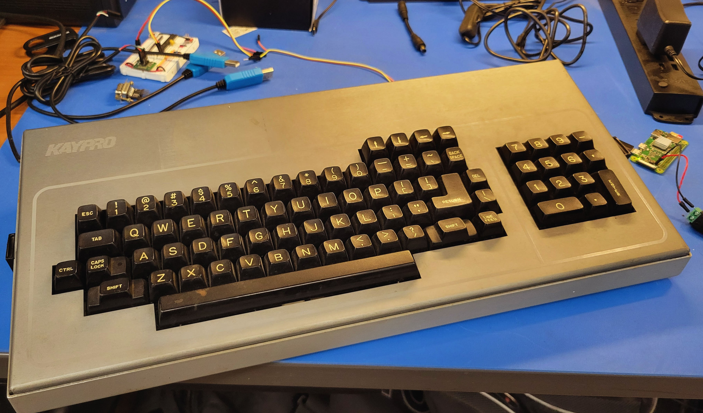
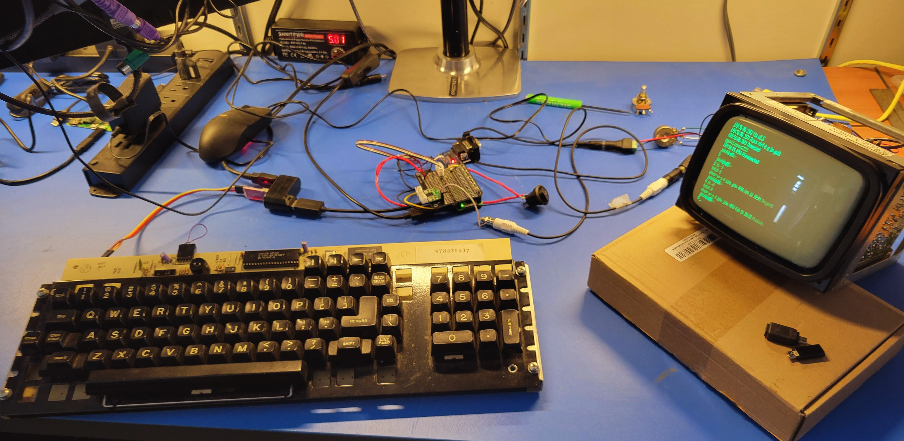
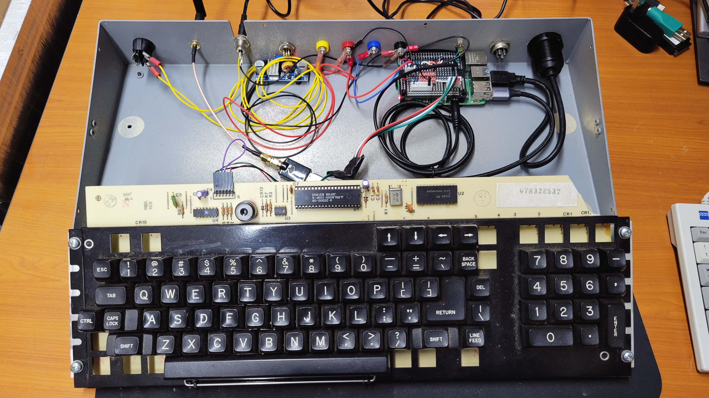
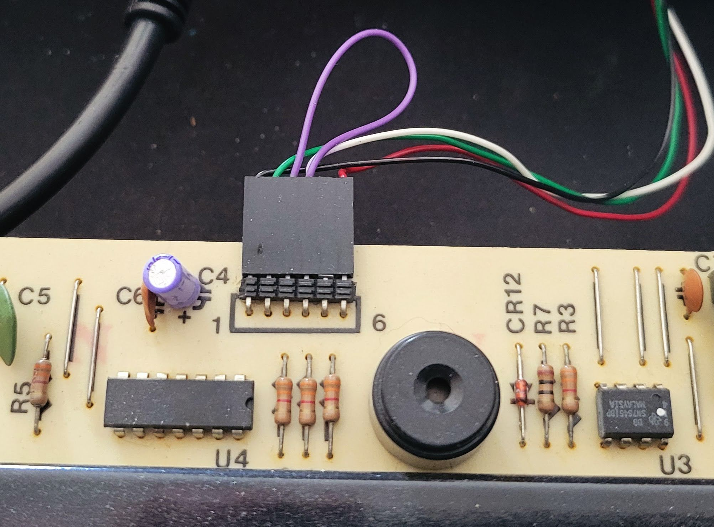

# :desktop_computer::loop::keyboard: SerKey
Linux serial keyboard driver that supports the Kaypro keyboard and other custom key mappings

Utilizes the [uinput kernel module](https://kernel.org/doc/html/v4.12/input/uinput.html)
to implement a user mode application or daemon for the Kaypro keyboard. This has only been
tested on Raspberry PI OS.

## Download this repository
```console
sudo apt update
sudo apt install git
git clone https://github.com/racerxr650r/SerKey.git
```

## Build the application
```console
cd SerKey
make
```
Change to the SerKey directory and build the application

## Setup permissions to run from your user account
```console
make permissions
```
This will create a uinput group, add your user to it, and setup a udev rule
to make /dev/uinput read/writeable by your user/group.

## Run the application
```console
make run OPTIONS="-f" DEVICE="/dev/ttyAMA4"
```
Or...
```console
./build/serkey -f /dev/ttyAMA4
```
This will launch the application with the fork/daemon option using the ttyAMA4
serial device. Substitute the options and device you require. See the usage
section for details about the options.

## Install serkey
```console
make install OPTIONS="-b 300 -p none -d 8 -s 1 -k kaypro" DEVICE="/dev/ttyAMA4"
```
Installs the serkey application and documentation.

> [!NOTE]
> BINDIR (directory to install the binary file) and MANDIR 
(directory to install the man page documentation) can be defined from the 
make command line. This will replace the default values. The defaults for 
BINDIR and MANDIR should work for most Linux distributions

## Get usage information
```console
serkey -h
```
or...
```console
man serkey
```
man only works if you have installed serkey.

## Command line usage
```
USAGE: serkey [OPTION]... serial_device

User mode serial keyboard connected to serial device "serial_device"

OPTIONS:
  -b   <bps>
       Set the baud rate in bits per second (bps) (default:300)
  -p   odd|even|none
       Set the parity  (default:none)
  -d   5|6|7|8
       Set the number of data bits (default:8)
  -s   1|2
       Set the number of stop bits (default:1)
  -k   kaypro|media_keys|ascii|custom
       Select the key mapping (default:kaypro)
  -f   Fork the process to run as a background process
  -v   Verbose mode to display status information and keystroke codes
  -h   Display this usage information
```

## Uninstall serkey
```console
make uninstall
```
Uninstalls the serkey application and documentation.

## Daemonize serkey
```console
make daemon OPTIONS="-b 300 -p none -d 8 -s 1 -k kaypro" DEVICE="/dev/ttyAMA4"
```
Install the serkey application and documentation and create a .service file to
launch serkey as a daemon using systemd. This file will use the OPTIONS and
DEVICE defined	in the makefile or the make command line

> [!NOTE]
> OPTIONS, DEVICE, and SYSDDIR can be defined from the make
command line. This will replace the default values. The default for SYSDDIR
should work for Linux distributions that use the systemd init system. This
includes Raspberry Pi OS, Debian, Ubuntu, MX Linux, etc.

## Uninstall the serkey Daemon
```console
make undaemon
```
Uninstall the serkey application and documentation stop the serkey daemon and
remove the .service file from the systemd configuration directory

# Adding a custom key map to serkey
At the bottom of the serkey.c source file, find the keymap data structure. This
data structure defines the uinput key mappings for each character received from
the serial port.
```C
// Key Maps *******************************************************************
local keymap_t keymap[KEYMAPS][KEYS_PER_MAP] =
{
    { // Kaypro keymap ------------------------------------------------------------
        { .key = KEY_RESERVED, .control = false, .shift = false, .makebreak = true },   // 0	NULL(Null character)
        ...
        { .key = KEY_RESERVED, .control = false, .shift = false, .makebreak = true }    // 255	nbsp	(non-breaking space or no-break space)
    },
    { // ASCII Keymap --------------------------------------------------------------
        { .key = KEY_RESERVED, .control = false, .shift = false, .makebreak = false },   // 0	NULL(Null character)			
        ...
        { .key = KEY_RESERVED, .control = false, .shift = false, .makebreak = false }    // 255	nbsp	(non-breaking space or no-break space)
    },
    { // Media Keymap --------------------------------------------------------------
        { .key = KEY_MUTE, .control = false, .shift = false, .makebreak = false },           // 0
        ...
        { .key = KEY_RESERVED, .control = false, .shift = false, .makebreak = false }        // 255
   },
    { // Custom Keymap -------------------------------------------------------------
        { .key = KEY_MUTE, .control = false, .shift = false, .makebreak = false },           // 0
        ...
        { .key = KEY_RESERVED, .control = false, .shift = false, .makebreak = false }        // 255
   }
};
```
Each line of the keymap represents a character from the serial device. Serkey
assumes a single byte per keystroke. Thus there are 256 lines per key map. In
each line there are four parameters that describe the keystroke.

 * key - uinput keycode
 * control - state of the control key
 * shift - state of the shift key
 * makebreak - generate make and break key events

You have two options to create a custom key map. You can modify one of the
existing key maps or add a new key map. There are 4 existing key maps; Kaypro,
ASCII, Media, and Custom. Or, you can add an additional keymap.

The custom key map is provided to simplify customizing your own key map. If
you choose to add an additional keymap, you will need to update the KEYMAPS
constant to include the new keymap(s) and modify the `-k` option in the
parseCommandLine() function to add a string name(s) for the new key map(s).

# So you want to put a Raspberry Pi in your Kaypro Keyboard?

Kaypro sold a couple hundred thousand units back in the 80's and they have
been sitting in attics for the past 30+ years now. So, you can find parted
out examples pretty easily. In my case, I bought a couple broken incomplete
keyboards on eBay over the last 5-6 years. These were originally intended to
be spare parts for a complete system that I came across almost 10 years ago.
So when it came time to find a case for a new Raspberry PI project, they
were a pretty easy choice.



The Kaypro keyboard has a 5v TTL level serial connection to the base computer.
Digging through old manual with schematics and specifications, I found that
the interface is setup a 300 baud, no parity, 8 data bits, and 1 stop bit.
This could easily be interfaced to a Raspberry PI



While I had it apart, I measured the clearances and confirmed I could fit
a PI 4 with a protoboard hat inside the case behind the keyboard PCB. Here's
how I laid it out.



For my build, I used one of the four PI 4 serial ports. This required a
5v to 3.3v level shifter. That was easily wired up on a protoboard hat.
This connected to the keyboard PCB via the existing 6 pin connector. I
reused the original connector from the wire harness. The pinout is in 
the table below.

| Pin | Description |
|:---:|:------------|
|  1  | Power +5v   |
|  2  | Keyboard Tx |
|  3  | Ground      |
|  4  | Ground      |
|  5  | No Connect  |
|  6  | Keyboard Rx |

Keyboard pin out


